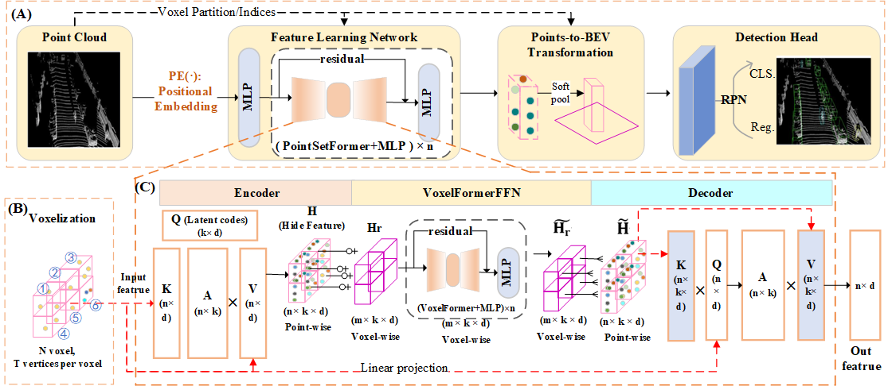

## VoxT-GNN：A 3D Object Detection Approach from Point Cloud based on Voxel-Level Transformer and Graph Neural Network

**Authors**: [Qiangwen Wen](https://github.com/yujianxinnian), [Sheng Wu*](http://adcfj.cn/sirc/door/team/TeacherList/Detail?personId=%20422), Jinghui Wei.

**Institution**: Introduction of The Academy of Digital China (Fujian), Fuzhou University, China

This project is built on [OpenPCDet](https://github.com/open-mmlab/OpenPCDet). 

## Introduction

In this paper, we present VoxT-GNN, an innovative framework that harnesses the strengths of both Transformer and Graph Neural Network architectures for 3D object detection from LiDAR point clouds. Within VoxT-GNN, we introduce the Voxel-Level Transformer (VoxelFormer) and GNN Feed-Forward Network (GnnFFN) components. We employ VoxelFormer to capture the local features of each point within a voxel. Furthermore, we integrate GnnFFN into both the encoder and decoder of VoxelFormer to facilitate cross-region (cross-voxel) information exchange, thereby enabling the extraction of global features. Comprehensive experimental results on the KITTI dataset indicate that our VoxT-GNN achieves competitive performance with notable advantages over state-of-the-art benchmark networks, particularly in detecting Cyclist and Pedestrian. 

### 1. Recommended Environment
- OpenPCDet Version: 0.5.2
- Linux (tested on Ubuntu 22.04)
- Python 3.7
- PyTorch 1.9 or higher (tested on PyTorch 1.13.0)
- CUDA 9.0 or higher (tested on CUDA 11.7)

voxt_gnn_pv_rcnn_plus.yaml need Version: 0.6.0

### 2. Set the Environment

```shell
pip install -r requirements.txt
python setup.py build_ext --inplace 
```
The [torch_geometric, torch_scatter, torch_sparse, torch_cluster, torch_spline_conv](https://pytorch-geometric.readthedocs.io/en/latest/install/installation.html) package is required


### 3. Data Preparation

- Prepare [KITTI](http://www.cvlibs.net/datasets/kitti/eval_object.php?obj_benchmark=3d) dataset and [road planes](https://drive.google.com/file/d/1d5mq0RXRnvHPVeKx6Q612z0YRO1t2wAp/view?usp=sharing)

```shell
# Download KITTI and organize it into the following form:
├── data
│   ├── kitti
│   │   │── ImageSets
│   │   │── training
│   │   │   ├──calib & velodyne & label_2 & image_2 & (optional: planes)
│   │   │── testing
│   │   │   ├──calib & velodyne & image_2

# Generatedata infos:
python -m pcdet.datasets.kitti.kitti_dataset create_kitti_infos tools/cfgs/dataset_configs/kitti_dataset.yaml
```

### 4. Pretrain model
You can use the pretrain model.


Link: https://pan.baidu.com/s/1n6iR-Wmd-ufGUCb9bJa6Hw  
Extraction code: r3cm

PLEASE NOTE: For the voxel-based methods, the point clouds are randomly sampled, which results in some deviation in the prediction outcomes for each instance. However, the deviation is not expected to be too large. This is a normal phenomenon.


The performance (using 11 recall poisitions) on KITTI validation set is as follows(single-stage):
```
Car  AP@0.70, 0.70, 0.70:
bev  AP:90.16, 88.10, 86.84
3d   AP:88.88, 78.54, 77.60

Pedestrian AP@0.50, 0.50, 0.50:
bev  AP:69.03, 63.65, 58.51
3d   AP:67.23, 60.63, 55.40

Cyclist AP@0.50, 0.50, 0.50:
bev  AP:91.95, 72.59, 69.92
3d   AP:90.75, 70.13, 65.70
```
The runtime is about **18 ms** per sample. (RTX 4090 GPU)


The performance (using 40 recall poisitions) on the KITTI test set (two-stage).
In two-stage models are not suitable to directly report results on KITTI test set, please use slightly lower score threshold and train the models on all or 90% training data to achieve a desirable performance on KITTI test set.
```
Car  AP@0.70, 0.70, 0.70:
bev  AP: 94.52 88.63 86.04
3D   AP: 90.26 81.53 77.07	
	
Pedestrian AP@0.50, 0.50, 0.50:
bev  AP: 54.30 48.12 45.84
3D   AP: 51.30 44.80 41.70

Cyclist AP@0.50, 0.50, 0.50:
bev  AP: 84.30 71.53 64.90
3D   AP: 82.84 67.88 60.42
```
### 5. Train

- Train with a single GPU

```shell
python train.py --cfg_file tools/cfgs/kitti_models/voxt_gnn.yaml
```

- Train with multiple GPUs 

```shell
cd VoxT-GNN/tools
bash scripts/dist_train.sh --cfg_file ./cfgs/kitti_models/voxt_gnn.yaml
```
### 6. Test with a pretrained model

```shell
cd VoxT-GNN/tools
python test.py --cfg_file --cfg_file ./cfgs/kitti_models/voxt_gnn.yaml --ckpt ${CKPT_FILE}
```
### 7. Acknowledgement

Some codes are from VoxSeT(https://github.com/skyhehe123/VoxSeT).


